# YSC App
## Công nghệ sử dụng
**Front-end**
- Framework: `VueJS`.
- Styling: `CSS` và `Bootstrap`.

**Back-end**
- Viết các service, xử lý request: `Python`.
- Cơ sở dữ liệu: `MongoDB`.
- Kiểm tra API: `Postman`.

## Hướng dẫn cài đặt
### Cài đặt Zato trên docker
1. Yêu cầu máy cần cài docker, nếu chưa cài thì có thể cài theo hướng dẫn trên trang chủ: [Cài đặt docker](https://docs.docker.com/engine/install/).

2. Cài đặt Zato 3.1

    1. Window
    
        Mở terminal chạy các lệnh sau 
        ```
        docker pull registry.gitlab.com/zatosource/docker-registry/quickstart:3.1-py3
        docker run --pull=always -it -p 22 -p 6379:6379 -p 8183:8183 -p 17010:17010 -p 17011:17011 \-p 11223:11223 --name zato \registry.gitlab.com/zatosource/docker-registry/quickstart:3.1-py3
        ```
        Mở một terminal khác, chạy lệnh sau để mấy tài khoản và mật khẩu cho trang quản trị
        ```
        docker exec zato cat /opt/zato/web_admin_password
        ```
        Truy cập vào http://localhost:8183, sử dụng username là admin và mật khẩu nhận được từ câu lệnh trên để đăng nhập vào dashboard.
        Khởi động zato
        ```
        docker start -i zato
        ```
    2. Linux
        
        Mở terminal chạy các lệnh sau
        ```
        sudo docker pull registry.gitlab.com/zatosource/docker-registry/quickstart:3.1-py3
        sudo docker run -it -p 22 -p 6379:6379 -p 8183:8183 -p 17010:17010 -p 17011:17011 \-p 11223:11223 --name zato \registry.gitlab.com/zatosource/docker-registry/quickstart:3.1-py3
        ```
        Mở một terminal khác, chạy lệnh sau để mấy tài khoản và mật khẩu cho trang quản trị
        ```
        sudo docker exec zato /bin/bash -c 'cat /opt/zato/web_admin_password
        ```
        Truy cập vào http://localhost:8183, sử dụng username là admin và mật khẩu nhận được từ câu lệnh trên để đăng nhập vào dashboard.
        Khởi động zato
        ```
        sudo docker start -i zato
        ```
### Cấu hình service và các connection
1. Cài các thư viện, module hỗ trợ

    Clone project về, mở terminal nơi chứa project chạy lệnh sau
    ```
    git clone -b zato_3.1 https://github.com/frankkhiem/YSC-ZatoESB.git
    ```
    
    Mở 1 tab terminal mới, vào bên trong server zato, nếu thành công thì đường dẫn sẽ đổi thành /opt/zato/{zato_version}/code#
    ```
    docker exec -it {tên container zato} bash
    ```
    Chạy các lệnh sau để cài đặt thư viện hỗ trợ connect MongoDB
    ```
    ./bin/pip install dnspython
    ./bin/pip install pymongo[srv]
    ./bin/pip install mongoengine
    ```
    Tiếp đến cài đặt các module model đại diện cho các Document trong MongoDB, mở 1 terminal mới tại thư mục chưa project clone về
    ```
    git checkout zato_3.1
    docker cp ./models/models.py {tên container zato}:/opt/zato/current/zato_extra_paths/
    ```
    Sử dụng terminal đang ở server zato gõ lệnh sau, nếu thấy file models.py là được 
    ```
    ls /opt/zato/current/zato_extra_paths/
    ```
    Khởi động lại server zato
2. Upload auth service vào zato 

    Truy cập http://localhost:8183 để vào giao diện dashboard
    
    Tại dashboard, Chọn Services -> List services -> Upload services, tải lên các file trong thư mục /services/auth_services ở thư mục dự án vừa clone về.
    
    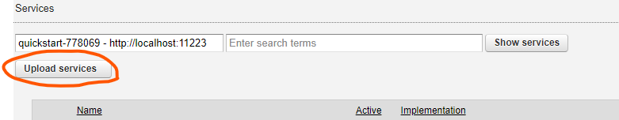
    
    Vào Connections => Outgoing => REST để tạo connector tới services auth của firebase, lần lượt tạo các outconnn sau, các giá trị phải để như trong ảnh
    
    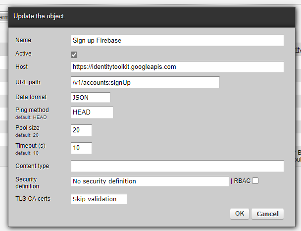
    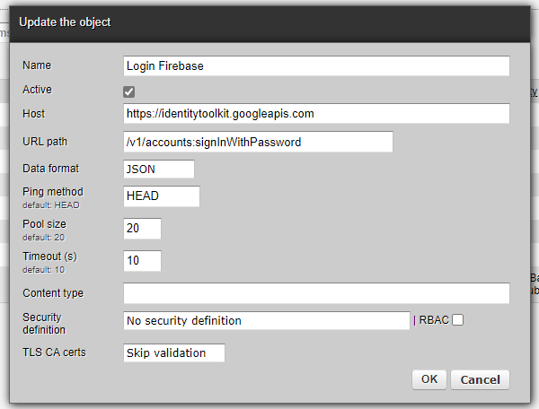
    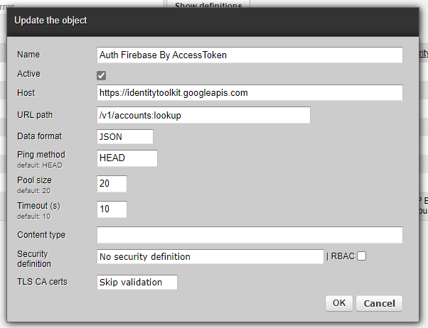
    
    Tiếp theo vào Connections => Channels => REST để xuất auth_services dưới dạng REST Api
    
    API đăng ký tài khoản
    
    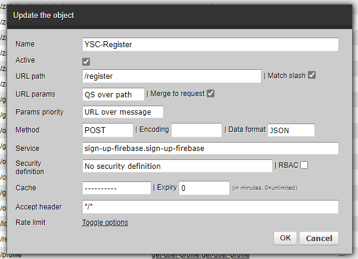
    
    API đăng nhập tài khoản
    
    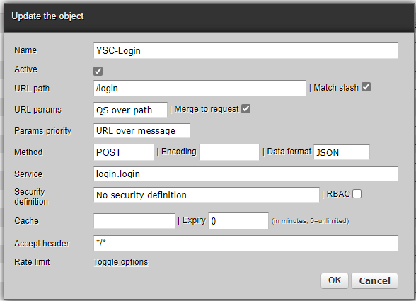
    
3. Upload user service vào zato

    Upload các file service ở thư mục /services/user_services như phần trên
    
    Vào Connections => Channels => REST tạo các channel sau 
    
    Api get thông tin user
    
    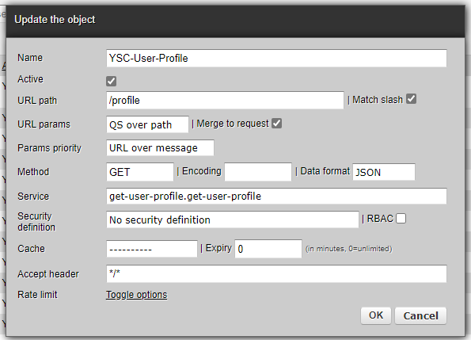
    
    Api get danh bạ đã được đồng bộ của user
    
    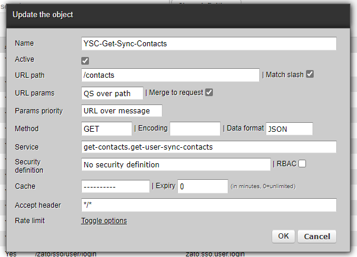
    
    Api gọi service đồng bộ danh bạ, trả về thời gian đồng bộ và danh bạ đã được đồng bộ
    
    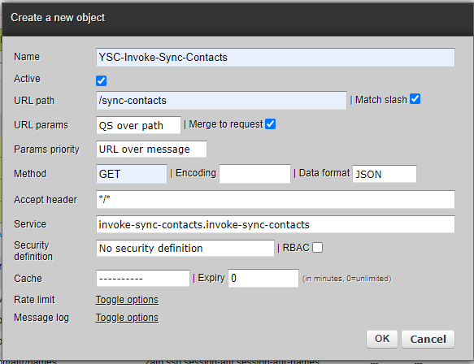
    
    Api chỉnh sửa thông tin hồ sơ user
    
    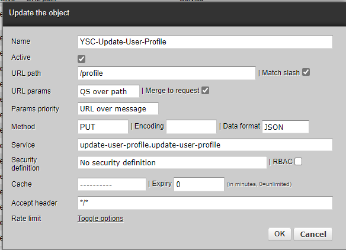

4. Upload google service vào zato

    Upload các file trong /services/google_services vào list services
    
    Vào Connections => Outgoing => REST tạo connector tới services của google để liên kết và lấy contacts về
    
    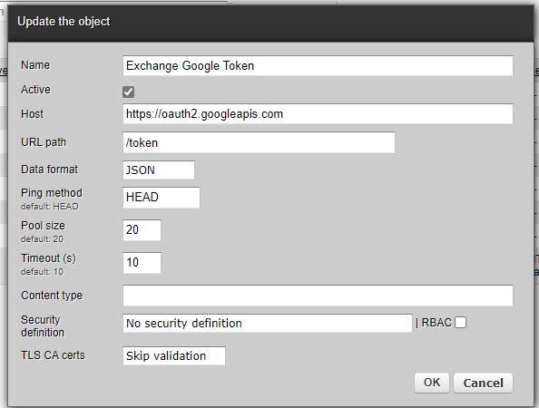
    
    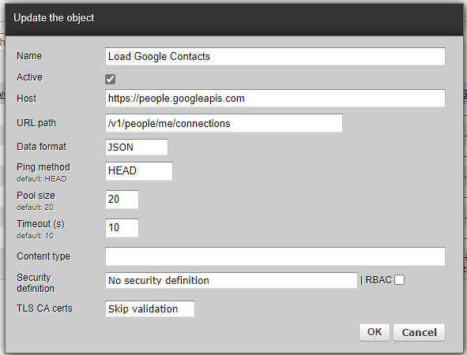
    
    Vào Connections => Channels => REST tạo các channel REST mới sau 
    
    API trao đổi token của google
    
    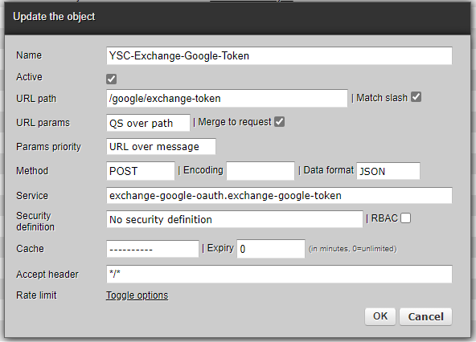
    
    Api load contacts từ google lưu vào database
    
    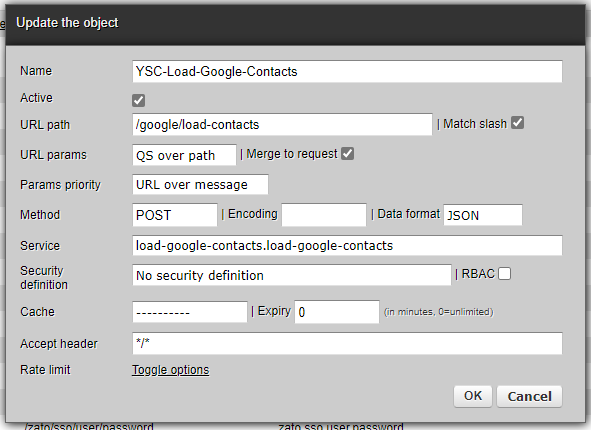
    
    Api get danh sách contacts google của user
    
    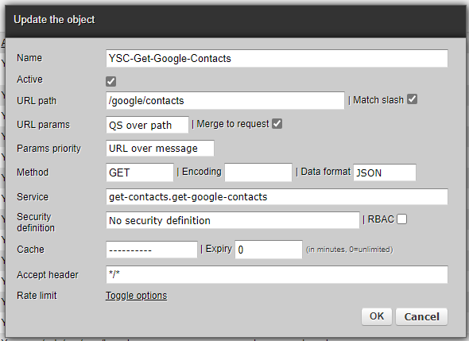
    
5. Upload outlook service vào zato
    
    Upload tất cả file trong /services/outlook_services vào list services
    
    Vào Connections => Outgoing => REST tạo connector tới services của microsoft để liên kết và lấy outlook contacts về
    
    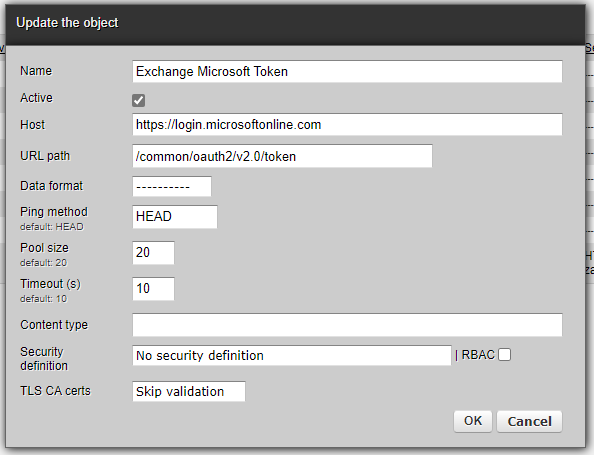
    
    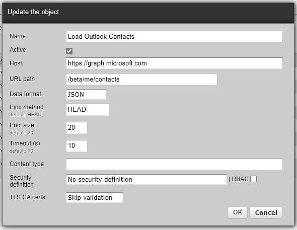
    
    Vào Connections => Channels => REST tạo các channel REST mới sau
    
    Api trao đổi token của microsoft
    
    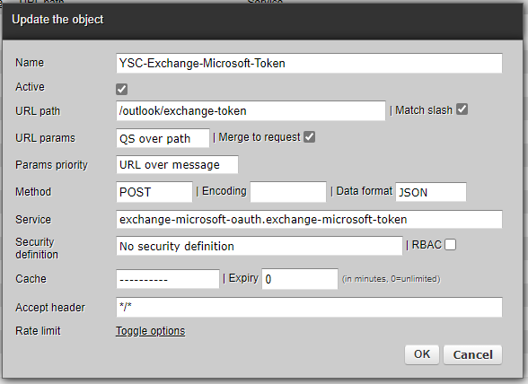
    
    Api load contacts từ outlook lưu vào database
    
    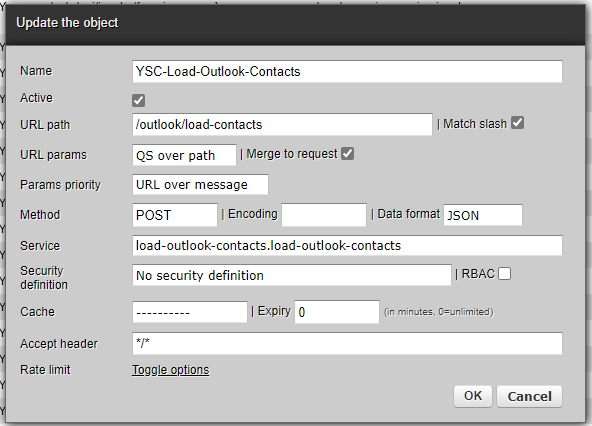
    
    Api get danh sách contact outlook của user
    
    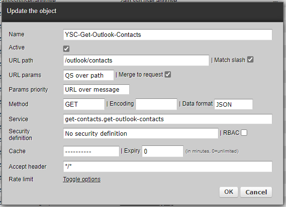
    
    
    
    
    
    
    
    
    
        
        
        
        
        
        
        
        
        
        
        
        
        
        
        
        
        
        
        
        
        
        
        
        
        
        
